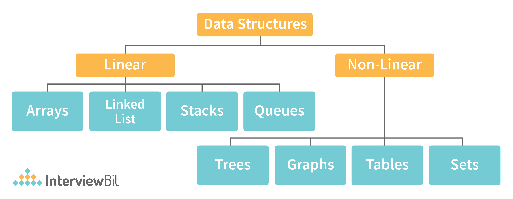

## 자료구조란 무엇인가

### Data Structure
자료의 효율적인 접근 및 수정을 가능케 하는 자료의 조직, 관리, 저장을 자료구조라 칭한다.
적절한 자료구조를 적용했을 때 자료를 더 효율적으로 저장하고 관리하며 실행시간 단축 및 메모리 용량의 절약을 이끌 수 있다.

### 자료구조의 선택 기준

- 자료의 처리시간
- 자료의 크기
- 자료의 활용빈도
- 자료의 갱신 정도
- 프로그램의 용이성

### 자료구조의 특징
1. 효율성
 - 자료구조를 사용하는 목적은 데이터를 목적에 맞게 효율적으로 관리 및 사용하는 것
 - 적절한 자료구조를 선택하여 사용한다면 코드의 효율UP

2. 추상화
 - 추상화란 복잡한 자료, 모듈, 시스템 등으로부터 핵심적인 개념만을 간추려 내는 것
 - 자료구조를 구현할 때 중요한 것은 어느시점에 데이터를 삽입할 것이며 어느 시점에 데이터를 어떻게 사용할 것인지에 대해 초점을 맞출 수 있기 때문에 구현 외적인 부분에 더 시간을 쏟을 수 있음

3. 재사용성
 - 다양한 프로그램에서 동작할 수 있도록 범용성 있게 설계


### 자료구조의 분류

자료구조는 선형과 비선형으로 분류
- 데이터가 일렬로 나열 -> 선형구조
- 데이터가 특정한 형태를 지님 -> 비선형구조

#### 선형구조
 - 배열(Array)
 - 연결리스트(Linked List)
 - 스택(Stack)
 - 큐(Queue)

#### 비선형구조
 - 트리(Tree)
 - 그래프(Graph)
 - 테이블(Table)
 - 셋(Set)

```
Reference by  "https://www.interviewbit.com/data-structure-interview-questions/"
```